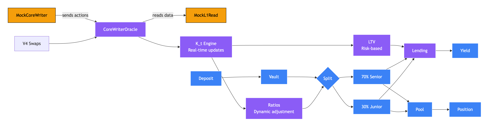

# Anthem: Hyperliquid-Powered Risk Tranching
**Live on Arbitrum Sepolia · Solves HLP's $20M ADL Waste Problem**

---

## 🎯 The Problem
HLP faces **$20M+ annual ADL waste** with no risk choice for LPs.  
$47B weekly volume vs $372M TVL creates a **126x gap** where all LPs suffer equally during stress.

---

## ⚡ Solution: Dynamic Risk Tranching
**70-85% Senior (Protected) + 15-30% Junior (Risk Premium)**

Real-time adjustments via CoreWriterOracle using:
- ✅ Uniswap V4 stress (live)
- 🔄 Hyperliquid data (ready)
- 🎯 Priority score k_t (42 current)

---
CoreWriterOracle implements two key Hyperliquid interfaces:

1. L1Read Interface - For reading Hyperliquid data
interface IL1Read {
    struct AccountMarginSummary {
        int64 accountValue;
        uint64 marginUsed;  // Current: 750,000 (75% usage)
        uint64 ntlPos;
        int64 rawUsd;
    }
    
    function accountMarginSummary(uint32 perp_dex_index, address user) 
        external view returns (AccountMarginSummary memory);
    
    function oraclePx(uint32 index) external view returns (uint64);
}

2. CoreWriter Interface - For sending actions to Hyperliquid
interface ICoreWriter {
    function sendRawAction(bytes calldata data) external;
}

### Communication Flow

**CoreWriterOracle → MockL1Read:**
1. Calls `accountMarginSummary(0, address(this))`
2. Returns: `{accountValue: 1,000,000, marginUsed: 750,000 (75%)}`
3. Event: `HyperliquidDataUsed(perpIndex: 0, marginUsed: 750000)`

**CoreWriterOracle → MockCoreWriter:**
1. Calls `sendRawAction(abi.encode("anthem_priority_update", 37))`
2. Event: `CoreWriterActionSent("priority_update", 37)`

**Results:**
- Priority score: 25 → 37 (+12 with Hyperliquid data)
- Senior ratio: 85% → 72.37%
- LTV adjustment: -1.4%

---

## HyperEVM Ready
- MockL1Read 0x86cA01b5a3898750013C816aCcda2238506D608A and MockCoreWriter 0x2463CD6E16Ea28E76D646c7f56288a7Cb263F05A take the logic from L1Read and CoreWriter

---

## 🔧 Valantis Integration
SovereignPool implements Valantis interfaces:
- `depositLiquidity()` / `withdrawLiquidity()`
- 0.3% pool fees with ALM management
- Compatible with Valantis ecosystem

---

## Architecture Components

### 1. AnthemVault (0x7c8aa139D6dB1BeBcd26299b3ee963E91c23800e)
Accepts USDC deposits, dynamically splits into Senior/Junior tokens based on k_t score.

### 2. CoreWriterOracle (0xA98BE8D7896C26edD7166b6F046026Aa8F8b8C37)
Central risk engine that:
- Processes V4 swap stress events
- Integrates with Hyperliquid mocks
- Calculates priority score (k_t: 0-100)
- Adjusts tranche ratios (85% → 72% → 70%)
- Updates LTV (32-38% range)

### 3. SovereignPool (0xF8CB819086Fd034450197f1Fd4CA8B2542953834)
Valantis-compatible liquidity pool for Senior/Junior token trading with 0.3% fees.

### 4. AnthemSovereignALM (0x0687eb62257c425AE9DaBE0B85C8F5781E63Cf29)
Automated Liquidity Manager that:
- Manages pool allocations
- Responds to k_t changes
- Implements Valantis ALM interface

### 5. AnthemLendingModule (0xca5b11a3f14E410dEddfc1B53226E0fB0655C252)
Risk-adjusted lending with ADL-adjusted LTV (32-38%).

### 6. V4 Swap Executor (0xb8aD836c8a31Dc7fD842b4b328f39f3d3aa6F781)
Creates stress events for CoreWriterOracle in Uniswap V4 BTC/USDC and ETH/USDC pools.

## How to run UI
### 1. git clone https://github.com/tatdz/anthem
### 2. cd frontend and npm install
### 3.create .env.local file with
NEXT_PUBLIC_ANTHEM_SENIOR=0x44f2f69af1d92a1d572dcAD512d0aBBC93B0631c
NEXT_PUBLIC_ANTHEM_JUNIOR=0x612b59DE2116D2aD143Cc682b7050a8d1ea710A2
NEXT_PUBLIC_SOVEREIGN_POOL=0xF8CB819086Fd034450197f1Fd4CA8B2542953834
NEXT_PUBLIC_ANTHEM_VAULT=0x7c8aa139D6dB1BeBcd26299b3ee963E91c23800e
NEXT_PUBLIC_ANTHEM_LENDING_MODULE=0xca5b11a3f14E410dEddfc1B53226E0fB0655C252
NEXT_PUBLIC_ANTHEM_SOVEREIGN_ALM=0x0687eb62257c425AE9DaBE0B85C8F5781E63Cf29
NEXT_PUBLIC_MOCK_L1_READ=0x86cA01b5a3898750013C816aCcda2238506D608A
NEXT_PUBLIC_MOCK_CORE_WRITER=0x2463CD6E16Ea28E76D646c7f56288a7Cb263F05A
NEXT_PUBLIC_COREWRITER_ORACLE=0xA98BE8D7896C26edD7166b6F046026Aa8F8b8C37
NEXT_PUBLIC_V4_SWAP_EXECUTOR=0xb8aD836c8a31Dc7fD842b4b328f39f3d3aa6F781

NEXT_PUBLIC_WS_URL=wss://arbitrum-sepolia.api.onfinality.io/public-ws

# ============ NETWORK ============
NEXT_PUBLIC_CHAIN_ID=421614

# ============ CORE CONTRACTS ============
# PoolManager (Uniswap v4 core)
NEXT_PUBLIC_POOL_MANAGER=0xFB3e0C6F74eB1a21CC1Da29aeC80D2Dfe6C9a317

# PositionManager (Uniswap v4 periphery)
NEXT_PUBLIC_POSITION_MANAGER=0xAc631556d3d4019C95769033B5E719dD77124BAc

# Permit2 (ERC20 permit helper)
NEXT_PUBLIC_PERMIT2=0x000000000022D473030F116dDEE9F6B43aC78BA3

# Universal Router
NEXT_PUBLIC_UNIVERSAL_ROUTER=0xeFd1D4bD4cf1e86Da286BB4CB1B8BcED9C10BA47

# PoolSwapTest 
NEXT_PUBLIC_POOL_SWAP_TEST=0xf3A39C86dbd13C45365E57FB90fe413371F65AF8

# ============ MOCK TOKENS ============
NEXT_PUBLIC_UI_MOCK_USDC=0x164D636e9c513472E310a17c55B6C78994bF5307
NEXT_PUBLIC_UI_MOCK_ETH=0x4d25fD9A4ECD62Bc2C61F1cc1229b660296E0d03
NEXT_PUBLIC_UI_MOCK_BTC=0x8C46d0f2D9822DbdE9794460712f50b3b69BD6d9

ALCHEMY_ARBITRUM_TESTNET_URL=https://arb-sepolia.g.alchemy.com/v2/-yourkey
CHAIN_ID=421614

NEXT_PUBLIC_ENABLE_INJECTED_ONLY=true

and then run in cd/frontend: npm run dev:with-automation
